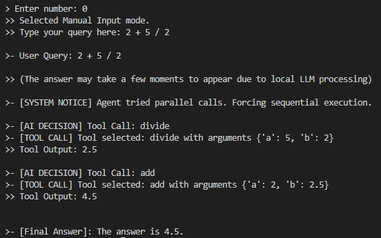
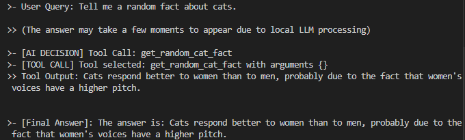

# OmniAgent: Local Reasoning AI Agent

This repository contains an end-to-end implementation of a local AI Agent capable of sequential reasoning and tool usage. Unlike standard chatbots that rely solely on training data, OmniAgent can identify when to use external tools (calculators) to solve problems accurately and when to use internal knowledge for general conversation.

The project is built with Python, LangChain, and Ollama, running 100% locally with the Llama 3.1 model.

## Topics
- [Overview and Objectives](#overview-and-objectives)
- [Architecture](#architecture)
- [Agent Logic and Protocols](#agent-logic-and-protocols)
- [Tools and Capabilities](#tools-and-capabilities)
- [How to Run](#how-to-run)
- [File Structure](#file-structure)
- [Author](#author)

## Overview and Objectives
Large Language Models (LLMs) are excellent at creative writing but often fail at precise mathematical calculations due to their probabilistic nature.

The objective of this work is to create a "ReAct" (Reasoning and Acting) agent that solves two fundamental problems:
1. **Hallucination in Math:** Preventing the model from guessing numbers by forcing it to use Python functions.
2. **Sequential Logic:** Enabling the model to solve multi-step problems (e.g., "Add these numbers, then multiply the result") by executing one step at a time.

## Architecture
The solution is built on a modular architecture separating the "Brain" (LLM) from the "Tools" (Functions).

1.  **Local Inference:** Uses **Ollama** to run the Llama 3.1 (8B) model locally, ensuring privacy and zero cost.
2.  **Orchestration:** Uses **LangChain** to bind Python functions to the model and manage the conversation history.
3.  **Execution Loop:** A custom Python loop in `main.py` that intercepts the model's decisions, executes the requested tool, and feeds the result back to the model for the next step.

## Agent Logic and Protocols
The agent uses a strict system instruction to decide how to behave.

### Decision Protocol
The agent evaluates every user input against two categories:

| Query Type | Behavior | Example |
| :--- | :--- | :--- |
| **Mathematical** | **Strict Mode.** Must use tools. Execution is forced to be sequential (one step at a time). Mental calculation is forbidden. | "Calculate 15 * 27" |
| **General Knowledge** | **Conversational Mode.** Uses internal training data. No tools are triggered. | "What is Star Wars?" |

### Sequential Reasoning Fix
A common issue with smaller local models is "Parallel Calling," where the model tries to run all steps at once (e.g., trying to multiply a result it hasn't calculated yet).

This project implements a **Sequential Guard** in the code:
- If the model requests multiple tools simultaneously, the system forces it to execute only the first one.
- The result is returned, and the model is prompted to calculate the next step based on real data.

## Tools and Capabilities

### Mathematical Core
The agent has access to atomic mathematical functions. It is prohibited from passing full equations (like "2+2") and must break them down into arguments.

* `add(a, b)`: Sum of two numbers.
* `sub(a, b)`: Subtraction.
* `multiply(a, b)`: Multiplication.
* `divide(a, b)`: Division (includes error handling for division by zero).

### Bonus: External API Integration (Hybrid Mode) 🐱
To demonstrate the agent's ability to interact with the internet (not just local functions), I integrated a public API. This transforms the project into a Hybrid Agent (Offline Logic + Online Data).

get_random_cat_fact(): Performs an HTTP GET request to the Cat Fact API (catfact.ninja) to retrieve real-time data.

Protocol: The agent identifies keywords like "cat fact" or "curiosity about cats," triggers the API, and incorporates the external data into its final answer.

### Special Behaviors (Easter Eggs)
The agent is programmed with specific triggers to demonstrate conditional prompt engineering:
* **Hitchhiker's Guide:** If asked about "the answer to life, the universe, and everything," it replies with "42".
* **The Matrix:** Unique response triggered by specific keywords.

## How to Run

### Prerequisites
* **Python 3.10+**
* **Ollama:** Must be installed and running.

### Step 1: Install and Prepare Ollama
Download Ollama from the official website. Then, open your terminal and pull the required model:

```bash
ollama pull llama3.1
```

### Step 2: Clone and Setup Environment

### For Windows (PowerShell):

### 1. Clone the repository
```bash
git clone https://github.com/vini-mon/OmniAgent

cd OmniAgent
```

### 2. Create virtual environment
```bash
python -m venv venv
```

### 3. Activate environment
```bash
.\venv\Scripts\activate
```

### 4. Install dependencies
```bash
pip install requests

pip install langchain langchain-ollama python-dotenv
```

### For Linux / MacOS:

### # 1. Clone the repository
```bash
git clone https://github.com/vini-mon/OmniAgent.git

cd OmniAgent
```

### # 2. Create virtual environment
```bash
python3 -m venv venv
```

### # 3. Activate environment
```bash
source venv/bin/activate
```

### # 4. Install dependencies
```bash
pip install requests

pip install langchain langchain-ollama python-dotenv
```
### Step 3: Configuration

Create a .env file in the root directory to manage your configuration. You can use the provided example:

### Copy the example file

```bash
cp .env.example .env
```

Ensure your .env contains:

```bash
MODEL_NAME=llama3.1
TEMPERATURE=0
```

### Step 4: Execution
Run the main entry point. You will see a menu to select pre-defined test cases or type your own query.

```bash
 python main.py
```

## File Structure

```
    OmniAgent/
    │
    ├── agents/
    │   ├── __init__.py
    │   └── general_agent.py      # LLM initialization and Tool Binding
    │
    ├── tools/
    │   ├── __init__.py
    │   ├── calculator.py      # Mathematical functions (add, sub, mul, div)
    │   └── cat_tools.py       # API Integration (HTTP Requests)
    │
    ├── .env                   # Configuration file (not uploaded to git)
    ├── .env.example           # Example configuration
    ├── .gitignore             # Files to ignore (venv, keys)
    │
    ├── main.py                # Main execution loop and System Prompts
    │
    └── README.md              # Project documentation

```

## Visual Example (Prompt Line)

### Running the program


### Internal thoughts (Math)



### Internal thoughts (Cats)



## Author

Vinícius Santos Monteiro
* [GitHub - OmniAgent](https://github.com/vini-mon/OmniAgent)

* [LinkedIn](https://www.linkedin.com/in/vinicius-santos-monteiro-a3a88a1aa/)


---
